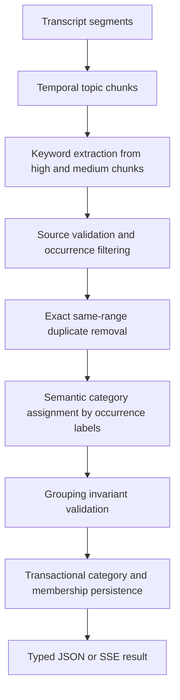

# refactor: Separate semantic categories from topic chunks

## Summary

Refactor analysis so temporal `TopicChunk` records remain internal grounding units while the API returns persisted semantic categories containing source-grounded contextual keyword occurrences. Expand keyword coverage, preserve occurrence-specific explanations and timestamps, remove empty categories, and give backend and iOS models stable category and occurrence identity.

---

## Problem Frame

The current FastAPI pipeline serializes every saved `TopicChunk` as an API category. Candidate extraction runs only for `high` chunks, so `medium` chunks appear as categories with empty `keywords` arrays. This conflicts with the product contract: categories are semantic groups such as OpenAI or Google, while keywords are concrete transcript-derived items such as ChatGPT, Codex, or Demis Hassabis.

Topic chunks are still valuable for transcript coverage, bounded LLM context, and source validation. The refactor must preserve that internal role while adding a separate grouping layer over validated keyword occurrences. Keyword identity is contextual rather than term-based: repeated display terms remain separate when they express different claims, explanations, mechanisms, implications, risks, or examples at different transcript sections.

---

## Requirements

**Keyword extraction and grounding**

- R1. Extract keyword candidates from `high` and `medium` topic chunks; continue excluding `low` and `off_topic` chunks.
- R2. Treat people, products, organizations, technologies, named concepts, and reusable claims or mechanisms as keyword candidates. Never promote a topic-chunk title merely to avoid an empty result.
- R3. Every YouTube keyword must retain at least one precise, validated segment reference and timestamped URL. Manual-input keywords must retain a grounded excerpt instead.
- R4. Invalid or unresolved YouTube source references must reject the candidate or fail analysis; they must not fall back to the parent chunk's start timestamp.
- R5. Treat each contextual keyword occurrence as a distinct record with its own `candidateClippingId`, source range, timestamp, brief, and three explanation levels.
- R6. Keep repeated normalized terms as separate occurrences whenever their resolved source segment ranges differ. Equal or semantically similar terms are not a deduplication criterion across timestamps.
- R7. Collapse only accidental duplicate extraction records having both the same normalized term and the same resolved source segment range. Deduplication must not combine context from different ranges.
- R8. Keep `level2` and `level3` grounded in the specific occurrence's transcript section; they must not synthesize claims or context from other appearances of the term.

**Semantic categories**

- R9. Group retained occurrence IDs semantically after extraction. A category may contain occurrences from different topic chunks and timestamps, including repeated display terms.
- R10. Every returned category must contain at least one keyword occurrence, have a unique normalized title, and contain no category-level source or timestamp.
- R11. Every retained occurrence ID must belong to exactly one category. The grouping model may not invent, rewrite, omit, merge, or duplicate occurrence IDs.
- R12. If no valid keyword occurrences remain, return `categories: []` without creating fallback categories or keywords.

**Persistence and API compatibility**

- R13. Persist each retained occurrence as its own `CandidateClipping`, then persist semantic categories and ordered occurrence memberships without changing the legacy `topic_chunks` or `candidate_clippings` table contracts used by the NestJS rollback service.
- R14. Return stable `categoryId` and occurrence-level `candidateClippingId` values. Remove category-level `topicChunkId`, because no single chunk represents a semantic category.
- R15. Retain singular `source` as the primary source for that occurrence. If ordered `sources` is retained, it may contain only references supporting the same contextual occurrence and must not aggregate other appearances of the term.
- R16. JSON and SSE result events must return the same response shape, and OpenAPI must document that shape.

**Client behavior**

- R17. The iOS client must identify categories by `categoryId` and keyword occurrences by `candidateClippingId`, never by display title or term.
- R18. Existing keyword display, explanation expansion, selection, and timestamp navigation must continue to work when a category contains duplicate display terms.

---

## Key Technical Decisions

- KTD1. **Keep temporal and semantic structures separate:** `TopicChunk` remains the extraction and provenance boundary; `KeywordCategory` becomes the output grouping entity. This avoids overloading one model with incompatible temporal and semantic meanings.
- KTD2. **Make identity occurrence-based:** A retained extraction occurrence is the keyword identity. Its `CandidateClipping` owns one contextual explanation ladder and one primary source range, with optional additional references supporting only that occurrence.
- KTD3. **Use a grouping-only LLM pass:** The grouping model receives compact occurrence labels such as `K001`, plus occurrence terms, kinds, briefs, and source-local context needed for categorization. It returns category titles and existing occurrence labels only. It does not regenerate explanations, sources, or keyword identities.
- KTD4. **Deduplicate only exact accidental occurrences:** Before grouping, collapse records only when normalized term and resolved source segment range are both equal. Preserve extraction order deterministically and never use fuzzy or model-driven keyword merging.
- KTD5. **Group before final persistence:** Collect validated occurrences in memory, remove exact accidental duplicates, assign every retained occurrence to a category, then persist occurrence clippings, categories, and memberships transactionally. This prevents incomplete category state from being committed.
- KTD6. **Persist memberships in a separate table:** Add `keyword_categories` and `keyword_category_memberships` rather than adding a category foreign key to `candidate_clippings`. Membership points directly to the occurrence's `candidateClippingId`, preserving its `TopicChunk` provenance and making ordering explicit.
- KTD7. **One category per occurrence:** Enforce a unique membership for each retained `candidateClippingId`. Multi-category membership is outside the current product model.
- KTD8. **Keep plural sources occurrence-local:** `source` remains the occurrence's primary reference. `sources` contains only multiple transcript ranges used to support that same contextual occurrence; repeated term appearances remain separate keyword records.
- KTD9. **Do not backfill legacy runs:** The new tables apply to analyses created after deployment. Existing topic-chunk-based results require rerunning analysis if semantic categories are needed.
- KTD10. **Prefer coverage over the current high-only optimization:** Process both `high` and `medium` chunks, then filter candidate-level `low` results before grouping. This increases LLM calls but matches the clarified keyword model.
- KTD11. **Allow meaningful singleton categories:** If a retained occurrence does not fit another semantic group, the grouping model may create a specific one-keyword category. It must not omit the occurrence or use a generic fallback solely to satisfy assignment.

---

## High-Level Technical Design



The grouping prompt should use model-echoable labels rather than database UUIDs. Its directional response contract is:

```json
{
  "categories": [
    {
      "title": "OpenAI",
      "keywordIds": ["K001", "K007"]
    }
  ]
}
```

`K###` values identify retained contextual occurrences for the duration of the grouping call. `K001` and `K007` may have the same display term and still remain separate. Validation must partition every retained occurrence label exactly once across categories, reject unknown, missing, or repeated labels, and reject empty categories. The grouping response has no operation capable of merging occurrences.

---

## Implementation Units

### U1. Define keyword and category contracts

- **Goal:** Add typed internal grouping structures and public response models before changing pipeline behavior.
- **Files:** `backend-fastapi/app/schemas.py`, `backend-fastapi/app/prompts.py`, `backend-fastapi/app/llm.py`, `backend-fastapi/tests/test_llm_validation.py`, `backend-fastapi/tests/test_api.py`
- **Changes:**
  - Add typed response models for source, keyword, category, and analysis result.
  - Add the strict grouping JSON schema and prompt with good and bad examples from the repository contract.
  - Define grouping output as category `keywordIds` containing occurrence labels only; do not expose any merge fields.
  - Add grouping-output validation for known occurrence labels, normalized titles, non-empty categories, complete single assignment, and deterministic ordering.
  - Document the typed analysis model for `application/json` and add an explicit `text/event-stream` response description with named progress, result, and error event examples.
  - Validate the completed result with the same Pydantic response model before serializing either JSON or the SSE `result` event.
- **Test scenarios:**
  - Accept cross-chunk occurrence labels, including repeated display terms, grouped under one category.
  - Reject unknown labels, duplicate assignments, missing assignments, duplicate normalized category titles, and empty categories.
  - Reject grouping output that rewrites or attempts to merge occurrence IDs.
  - Confirm OpenAPI shows `categoryId`, `candidateClippingId`, `source`, and `sources`.
  - Confirm the explanation ladder remains unchanged in the response model.
- **Covers:** R9-R12, R14-R16.

### U2. Tighten keyword extraction and source invariants

- **Goal:** Produce the complete, precisely grounded candidate inventory required by semantic grouping.
- **Files:** `backend-fastapi/app/analysis.py`, `backend-fastapi/app/prompts.py`, `backend-fastapi/app/llm.py`, `backend-fastapi/tests/test_analysis.py`, `backend-fastapi/tests/test_llm_validation.py`
- **Changes:**
  - Run candidate extraction for `high` and `medium` chunks.
  - Revise candidate language from generic clippings toward concrete reusable keywords while retaining supported claim and mechanism kinds.
  - Instruct extraction to emit separate candidates when the same term carries meaningfully different context, even within one topic chunk.
  - Filter candidate-level `low` output before grouping.
  - Remove chunk-start fallback for unresolved YouTube references.
  - Construct manual-input source excerpts server-side from resolved transcript segments for both normal and fallback paths; treat model-provided source text as non-authoritative.
  - Update coverage review so eligible chunks without valid candidates are observable without producing empty API categories.
- **Test scenarios:**
  - Extract from high and medium chunks but skip low and off-topic chunks.
  - Reject a YouTube candidate whose labels cannot resolve inside its parent chunk.
  - Verify every accepted YouTube source URL contains the correct segment timestamp.
  - Verify manual candidates return grounded excerpts rather than timestamp URLs.
  - Ignore hallucinated model source text when valid manual segment labels are present and build the excerpt from those segments instead.
  - Extract two same-term candidates when they refer to distinct claims or mechanisms at different source ranges.
- **Covers:** R1-R6, R8.

### U3. Deduplicate exact occurrences and assign semantic categories

- **Goal:** Remove only accidental same-term, same-range extraction duplicates and assign every retained contextual occurrence to one semantic category.
- **Files:** `backend-fastapi/app/analysis.py`, `backend-fastapi/app/llm.py`, `backend-fastapi/app/prompts.py`, `backend-fastapi/tests/test_analysis.py`, `backend-fastapi/tests/test_llm_validation.py`
- **Changes:**
  - Build deterministic `K###` labels from chunk sequence and candidate order.
  - Compute an accidental-duplicate key from normalized term plus resolved start and end segment IDs. Collapse only records with an identical key, choosing the first extraction deterministically.
  - Preserve every candidate with a different resolved range, including candidates with equal or semantically similar terms.
  - Preserve the selected occurrence's brief and explanation ladder. Any plural source references retained during exact deduplication must support that same source-local occurrence.
  - Send retained occurrence labels to the grouping pass and accept only category titles plus `keywordIds`; remove model-driven semantic duplicate detection entirely.
  - Reject any grouping result that does not partition retained occurrence labels exactly once.
  - Skip the grouping call and return an empty category list when no retained occurrences remain.
  - Emit occurrence-deduplication and grouping progress events, track the active failure stage, and record extracted, filtered, exact-duplicate, retained, grouped, and discarded counts without transcript content.
- **Test scenarios:**
  - Group ChatGPT, Codex, and Sam Altman from separate chunks under OpenAI.
  - Keep two Codex occurrences at different timestamps as separate IDs in the OpenAI category.
  - Confirm each Codex occurrence retains its own `level2`, `level3`, primary source, and timestamp.
  - Collapse two records with the same normalized term and identical resolved segment range into one occurrence.
  - Do not collapse equal terms with different ranges or semantically similar terms.
  - Keep category and keyword order stable for identical grouping output.
  - Reject model-created, missing, repeated, rewritten, or merged occurrence IDs.
  - Return `categories: []` when extraction yields no retained occurrences.
  - Assert the occurrence-deduplication/grouping SSE stage sequence and safe failure-stage reporting.
- **Covers:** R5-R12.

### U4. Persist categories and ordered memberships

- **Goal:** Make semantic grouping durable and auditable while preserving rollback compatibility.
- **Files:** `backend-fastapi/alembic/versions/0002_add_keyword_categories.py`, `backend-fastapi/app/models.py`, `backend-fastapi/app/store.py`, `backend-fastapi/tests/test_analysis.py`
- **Changes:**
  - Add `KeywordCategory` and `KeywordCategoryMembership` ORM models.
  - Create `keyword_categories` with run-scoped sequence uniqueness and cascading analysis-run ownership.
  - Create memberships with category position, keyword position, foreign keys, and a unique constraint on occurrence-level `candidateClippingId`.
  - Persist each retained occurrence as a separate clipping, then persist categories and memberships in one transaction after grouping validation.
  - Keep each clipping attached to its original `topicChunkId`; no cross-chunk term-level keyword entity or merged provenance row is introduced.
  - Bump prompt and schema versions for new analysis runs.
- **Test scenarios:**
  - Alembic upgrades an existing baseline database without modifying legacy tables.
  - Deleting an analysis run cascades its semantic categories and memberships.
  - Duplicate category sequence or candidate membership is rejected.
  - Two clippings with the same title but different source ranges persist independently and can belong to the same category.
  - A persistence failure leaves no partial category graph.
- **Covers:** R5-R7, R13-R15.

### U5. Build the compatible API result from semantic categories

- **Goal:** Replace chunk-based response assembly with the typed, persisted category graph.
- **Files:** `backend-fastapi/app/analysis.py`, `backend-fastapi/app/main.py`, `backend-fastapi/app/schemas.py`, `backend-fastapi/tests/test_analysis.py`, `backend-fastapi/tests/test_api.py`
- **Changes:**
  - Serialize categories by category sequence and keywords by membership position.
  - Return `categoryId` and occurrence-level `candidateClippingId`; remove category-level `topicChunkId`.
  - Return each occurrence's own brief and explanation ladder without combining context from another occurrence.
  - Return singular `source` plus optional occurrence-local `sources`, with no category-level source fields and no aggregation by term.
  - Validate the completed response before marking the analysis run completed.
  - Keep JSON and SSE result serialization on the same code path.
- **Test scenarios:**
  - Assert no returned category has an empty keyword array.
  - Assert categories can contain keywords from multiple topic chunks.
  - Assert duplicate terms at different timestamps return separate `candidateClippingId`, `level2`, `level3`, and `source` values.
  - Assert `source == sources[0]` when `sources` is present and all YouTube sources are timestamped.
  - Assert `sources` never collects references from a separate same-term occurrence.
  - Assert JSON response and SSE `result` event payloads are equivalent.
  - Assert no semantic category contains `topicChunkId`.
- **Covers:** R5, R8-R16.

### U6. Move iOS rendering and selection to stable IDs

- **Goal:** Preserve client behavior while removing title- and term-based identity assumptions.
- **Files:** `ios/Core/Networking/AnalyzeModels.swift`, `ios/Features/Home/HomeView.swift`, `ios/Features/Home/AnalyzeResultView.swift`, `ios/NoteAppTests/AnalyzeModelsTests.swift`, `ios/NoteApp.xcodeproj/project.pbxproj`
- **Changes:**
  - Decode `categoryId`, `candidateClippingId`, and optional plural `sources` while retaining singular `source`.
  - Use `categoryId` and `candidateClippingId` for `ForEach`, expanded-category state, and selected-keyword state.
  - Keep titles, terms, explanation levels, and primary timestamp links as display values only.
  - Add a focused iOS test target if one is not already configured.
- **Test scenarios:**
  - Decode the revised payload and a legacy payload without additive ID/source fields during the compatibility window.
  - Render duplicate keyword terms in one category without identity collisions.
  - Preserve occurrence-specific selection, expansion, explanations, and timestamp navigation when display text is identical.
  - Open the primary timestamp from `source` while retaining additional sources in the model.
- **Covers:** R15, R17-R18.

### U7. Update contract documentation and operational verification

- **Goal:** Keep contributor guidance and manual API verification aligned with the shipped semantics.
- **Files:** `CLAUDE.md`, `backend-fastapi/README.md`, `README.md`
- **Changes:**
  - Extend the category and keyword contract in `CLAUDE.md` with contextual occurrence identity, exact same-range deduplication, duplicate display terms, and occurrence-local source rules.
  - Document the revised response example, contextual occurrence identity, duplicate display terms, and occurrence-local singular versus plural sources.
  - Document that legacy analysis rows are not backfilled and that the NestJS rollback response remains legacy-shaped.
  - Add a manual JSON and SSE verification example using a video with keywords repeated across sections.
- **Verification:** Confirm Docker startup applies migration `0002`, `/health` remains healthy, `/docs` shows the response schema, and a real analysis returns non-empty semantic categories with timestamped keywords.
- **Covers:** R13-R18.

---

## Acceptance Examples

- AE1. **Cross-chunk semantic grouping**
  - **Given:** ChatGPT, Codex, and Sam Altman are extracted from different temporal chunks.
  - **When:** Semantic grouping completes.
  - **Then:** One OpenAI category contains all three keywords, and each keyword retains its own timestamped source.
  - **Covers:** R3, R9-R11.

- AE2. **Repeated term with distinct contextual occurrences**
  - **Given:** Codex at 00:46 is introduced as an autonomous coding tool, and Codex at 05:12 is discussed as a competitive risk to software companies.
  - **When:** Exact-duplicate removal and semantic grouping complete.
  - **Then:** Two Codex keyword records are returned, each with a distinct `candidateClippingId`, primary timestamp, `brief`, `level2`, and `level3`. Both may belong to OpenAI, and neither explanation combines the two contexts.
  - **Covers:** R5-R6, R8-R11, R15, R17-R18.

- AE3. **Accidental same-range duplicate extraction**
  - **Given:** Extraction returns two Codex records with the same normalized term and the same resolved start and end segment IDs.
  - **When:** Exact-duplicate removal runs.
  - **Then:** One deterministic occurrence survives and is assigned to exactly one category; no model-driven merge is involved.
  - **Covers:** R7, R11.

- AE4. **Complete occurrence assignment**
  - **Given:** Five contextual occurrences survive filtering and exact-duplicate removal, including two with the display term Codex.
  - **When:** The grouping response is validated.
  - **Then:** Each of the five occurrence IDs appears exactly once across non-empty categories. A missing, unknown, repeated, rewritten, or merged ID rejects the grouping response.
  - **Covers:** R9-R11.

- AE5. **No useful keyword occurrences**
  - **Given:** Eligible chunks produce no valid high- or medium-signal keyword candidates.
  - **When:** Analysis completes.
  - **Then:** The response contains `categories: []`; no topic title is promoted to a keyword or empty category.
  - **Covers:** R2, R12.

- AE6. **Invalid YouTube source**
  - **Given:** The model returns a source label outside the keyword's parent chunk.
  - **When:** Candidate validation runs.
  - **Then:** The candidate is rejected or analysis fails with a safe source-reference error; the chunk start is never substituted.
  - **Covers:** R3-R4.

- AE7. **Duplicate-term client identity**
  - **Given:** One API category contains two Codex records with different `candidateClippingId` values.
  - **When:** iOS renders, expands, and selects the records.
  - **Then:** Both rows remain visible and independently interactive, and each opens its own timestamp without identity collisions.
  - **Covers:** R17-R18.

---

## Scope Boundaries

- Existing analysis runs are not backfilled into semantic categories.
- The NestJS rollback implementation is not upgraded to the new response semantics.
- Category editing, user-defined categories, and multi-category keyword membership are not included.
- Fuzzy synonym merging and cross-timestamp term collapsing are explicitly excluded.
- Source playback remains anchored to the primary `source`; UI for browsing additional `sources` is deferred.
- Automatic transcript-language selection is separate from category grouping and remains unchanged.

---

## System-Wide Impact

- **Latency and cost:** Candidate extraction expands to medium chunks and adds one grouping call. Keep grouping input compact and cap candidate counts per chunk to control token use.
- **Data lifecycle:** New category rows belong to an analysis run and cascade with it. Transcript reuse does not imply category reuse because grouping depends on model and prompt versions.
- **Rollback:** The migration adds tables only, so the NestJS rollback service can continue using the shared database. Its API output remains legacy-shaped.
- **Observability:** Add exact-duplicate removal and grouping stages to SSE progress and failure-stage tracking. Record counts for extracted, filtered, exact duplicates, retained occurrences, grouped occurrences, and discarded candidates without logging transcript content.
- **API behavior:** Category titles and ordering will change, and `topicChunkId` disappears from categories. Known iOS decoding is unaffected by removal, but other consumers must be checked before release.

---

## Risks and Mitigations

- **Grouping omissions or invented IDs:** Use strict provider schemas plus server-side partition validation; never trust model assignments directly.
- **Accidental loss of repeated terms:** Define deduplication strictly as normalized-term equality plus identical resolved start and end segment IDs; test different timestamps and different ranges as separate occurrences.
- **Context contamination:** Keep each occurrence's explanation ladder and sources attached to its own clipping; grouping assigns IDs only and cannot rewrite or combine occurrence content.
- **Ambiguous multiple source references:** Permit plural references only when they support the same contextual occurrence, preserve one primary range, and reject using `sources` as a term-level appearance index.
- **Inaccurate timestamps:** Remove chunk-level fallback and require resolvable segment labels for YouTube candidates.
- **Long-video grouping context:** Group only compact candidate metadata, not transcript text; batch only if measured candidate volume exceeds provider limits.
- **Client identity regressions:** Use `candidateClippingId` for SwiftUI occurrence identity and cover duplicate display terms in the same category.
- **Partial persistence:** Validate first and persist the category graph in one database transaction.

---

## Remaining Unresolved Issues

- **Multiple-reference occurrence boundary:** Define the validator for deciding when disjoint `sourceRefs` support one contextual occurrence rather than separate same-term occurrences. Until resolved, the primary resolved start/end range remains the deduplication key and plural references may not import context from another section.

Resolved during implementation:

- Legacy iOS payloads use deterministic transcript/category/keyword positional fallback identities; modern payloads use server IDs.
- Repository consumers were migrated away from category `topicChunkId`; the field is absent from the FastAPI response.
- Same-analysis-run ownership is enforced by a PostgreSQL constraint trigger and store validation. An opt-in disposable-database integration test covers upgrade, downgrade, trigger rejection, uniqueness, and cascade behavior.
- Invalid grounding or grouping output fails the analysis without silently dropping retained occurrences.

---

## Sources

- User clarification dated 2026-07-29 — contextual-occurrence keyword identity and occurrence-only grouping contract.
- `CLAUDE.md` — Category and Keyword Contract.
- `backend-fastapi/app/analysis.py:89` — current high-only extraction gate.
- `backend-fastapi/app/analysis.py:134` — current topic-chunk-to-category response mapping.
- `backend-fastapi/app/analysis.py:329` — source resolution and chunk-level fallback.
- `backend-fastapi/app/models.py:102` — temporal topic and candidate persistence models.
- `backend-fastapi/app/prompts.py:120` — current candidate-clipping prompt.
- `backend-nest/src/llm/category-extraction.prompt.ts` — prior category contract and source validation patterns; useful as reference, not as a whole-transcript implementation to restore.
- `ios/Core/Networking/AnalyzeModels.swift:25` — current category and keyword wire models.
- `ios/Features/Home/HomeView.swift:210` — title- and term-based SwiftUI identity assumptions.
