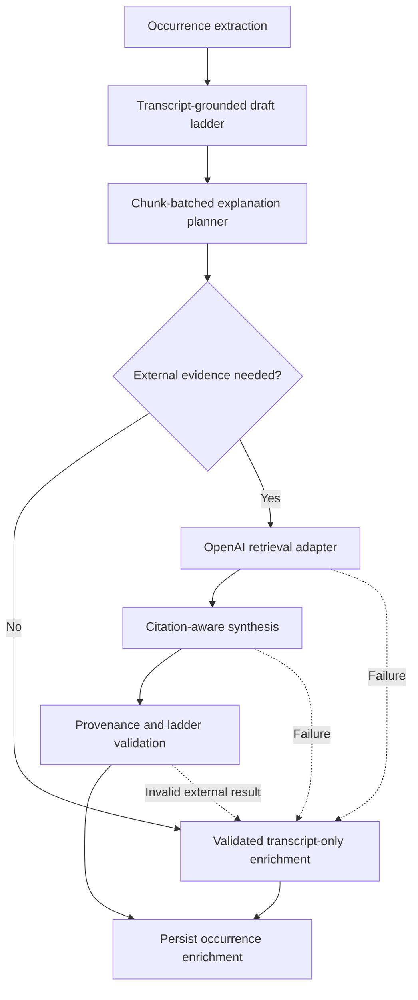

# Adaptive Citation-Backed Explanation Enrichment

## Summary

Improve keyword `level2` and `level3` explanations through an adaptive enrichment pipeline. The pipeline first uses occurrence-local transcript context, then retrieves external evidence only when that context leaves a meaningful explanatory gap. External information must be additive, cited, and kept separate from the transcript timestamp that identifies the keyword occurrence.

The first implementation supports external retrieval through OpenAI only. Gemini and Claude continue returning transcript-only explanations. Retrieval failure never fails the complete analysis.

## Problem

The current explanation contract requires `level2` and `level3` to remain entirely transcript-grounded. This preserves provenance but limits their educational value when the speaker assumes background knowledge, omits a mechanism, or refers to a product, organization, study, or current event without explanation.

Open-web enrichment for every keyword would create a different problem: unnecessary latency, noisy sources, overly broad interpretations of ambiguous terms, and a risk that external information replaces the speaker's actual point. The system needs to decide when additional evidence is useful and preserve the boundary between transcript claims and external clarification.

## Goals

- Keep keyword identity contextual-occurrence based.
- Preserve the speaker's occurrence-specific claim and transcript timestamp.
- Make `level2` and `level3` more useful when the transcript omits necessary background.
- Prefer transcript context and authoritative sources over general web results.
- Provide structured citation mappings without changing compatibility explanation strings.
- Degrade to transcript-only output when planning, retrieval, synthesis, or citation validation fails.
- Avoid external retrieval when it would not materially improve the explanation.

## Non-Goals

- Fact-checking or silently correcting the speaker.
- Combining separate occurrences of the same term.
- Treating external evidence as support for the transcript timestamp.
- Supporting Gemini or Claude retrieval in the first release.
- Building a general-purpose crawler, search index, or permanent external knowledge base.
- Requiring every keyword or explanation level to have an external citation.

## Explanation Contract

The progressive ladder remains:

- `term`: a short reusable concept label.
- `brief`: a glanceable explanation.
- `level1` / `simpleExplanation`: exactly one beginner-friendly, context-independent definition.
- `level2` / `contextualExplanation`: two to three sentences explaining what the term means in this occurrence, how it relates to the chunk, and why the speaker mentions it. It may include cited external clarification when transcript context is insufficient.
- `level3` / `detailedExplanation`: three to five sentences expanding the occurrence with useful reasoning, mechanism, implication, risk, example, or background. It may include cited external information when that information materially improves understanding.

Every level must remain distinct and progressively more detailed. External information in `level2` or `level3` must be additive: it may clarify or expand the speaker's point, but it must not replace, merge, or silently correct that point.

## Provenance Contract

Transcript and external provenance have different meanings and must remain separate:

- `source` is the primary transcript source for the contextual occurrence.
- `sources` contains only transcript references supporting that same occurrence.
- `externalSources` contains retrieved references used to enrich that occurrence.
- `level2CitationIds` identifies external sources supporting external information in `level2`.
- `level3CitationIds` identifies external sources supporting external information in `level3`.

An external source does not become an occurrence source. A repeated term at another timestamp remains a separate keyword record even when both occurrences use the same external reference.

## Architecture



### Stage 1: Transcript-Grounded Draft

Existing candidate extraction continues producing the complete occurrence record and a valid transcript-grounded explanation ladder. This draft is always a usable fallback.

### Stage 2: Explanation Planning

The planner runs once per topic chunk and receives an occurrence-specific context packet for each retained candidate:

```json
{
  "keywordId": "K007",
  "term": "Codex",
  "kind": "entity",
  "simpleExplanation": "Codex is an AI system that performs coding tasks.",
  "chunkTitle": "Competitive pressure on software companies",
  "chunkSummary": "...",
  "sourceExcerpts": ["...exact occurrence-local transcript excerpt..."],
  "transcriptLevel2": "...",
  "transcriptLevel3": "...",
  "videoTopicOutline": ["..."]
}
```

The topic outline is disambiguation context only. The planner may not import claims from another occurrence or combine separate appearances of the term.

For each occurrence, the planner:

1. Improves clarity using the supplied transcript context.
2. Identifies missing explanatory details.
3. Decides whether external evidence would materially improve the explanation.
4. Produces a focused research question and preferred source class when retrieval is needed.

The planner must not request retrieval merely to restate information already present in the transcript.

### Stage 3: Retrieval Routing

Only OpenAI analyses with at least one planner-approved research gap enter retrieval. Planning remains batched by topic chunk, while retrieval runs as bounded per-occurrence calls. This preserves unambiguous URL-citation attribution for repeated terms and still limits concurrency and latency at the chunk boundary.

Preferred evidence order is:

1. Official documentation, government publications, company sources, or other primary material.
2. Original research papers and recognized research institutions.
3. Established reference sources.
4. Reputable general web sources when stronger evidence is unavailable.

Routing depends on the gap:

- Stable concept or mechanism: authoritative glossary, documentation, or reference source.
- Product or organization: official documentation or first-party source.
- Research claim: original paper or institutional source.
- Current event, market claim, or changing fact: current web source.
- No meaningful gap: no retrieval.

The first release uses OpenAI web search as the retrieval mechanism. Search results must not be treated as valid citations until their URL and title pass server validation and the synthesis result explicitly maps them to an explanation level.

### Stage 4: Citation-Aware Synthesis

Synthesis receives the transcript draft, research question, and retrieved evidence. It may revise only `level2` and `level3`. It must:

- Preserve the occurrence-specific speaker claim.
- Keep `level1` unchanged.
- Distinguish speaker context from external clarification in the prose.
- Add no external factual claim without a mapped citation.
- Avoid unsupported inferences from search snippets.
- Use no more than three external sources per occurrence.
- Return empty citation arrays when no external information is used.

### Stage 5: Validation

Server validation remains authoritative. It checks:

- Existing term, brief, sentence-count, distinctness, and progressive-detail rules.
- Every occurrence ID is known and returned at most once by enrichment.
- Enrichment does not change occurrence identity, source ranges, `term`, `brief`, or `level1`.
- External citation IDs are unique within an occurrence.
- Every level citation ID resolves to exactly one `externalSources` entry.
- Every external source is referenced by at least one explanation level.
- URLs are absolute HTTP or HTTPS URLs and titles are non-empty.
- At most three external sources are retained per occurrence.
- External sources and citation IDs never move between contextual occurrences.

Validation cannot prove semantic entailment deterministically. A bounded OpenAI review pass checks that cited evidence supports the external claims and that enrichment is additive. If that review fails or remains invalid after bounded correction, the occurrence falls back to its transcript-only explanation.

## API Contract

The compatible keyword response gains additive fields:

```json
{
  "term": "Codex",
  "candidateClippingId": "...",
  "brief": "...",
  "level1": "...",
  "level2": "...",
  "level3": "...",
  "source": {
    "type": "youtube",
    "ref": "https://www.youtube.com/watch?v=...&t=312s"
  },
  "sources": [
    {
      "type": "youtube",
      "ref": "https://www.youtube.com/watch?v=...&t=312s"
    }
  ],
  "level2CitationIds": ["C1"],
  "level3CitationIds": ["C1", "C2"],
  "externalSources": [
    {
      "citationId": "C1",
      "title": "Source title",
      "url": "https://example.com/source"
    }
  ]
}
```

The three new fields default to empty arrays. JSON and SSE result payloads use the same typed response model. Existing clients that ignore unknown fields remain compatible.

## Persistence

External evidence must remain occurrence-local and durable. Add:

- `candidate_external_sources`
  - `id`
  - `candidateClippingId`
  - `citationId`
  - `title`
  - `url`
  - ordered `sequence`
- `candidate_external_citations`
  - `candidateClippingId`
  - `externalSourceId`
  - `level` constrained to 2 or 3
  - ordered `sequence`

Constraints enforce unique citation IDs per candidate, unique level/source mappings, valid candidate ownership, and cascading deletion. The existing candidate clipping row continues owning `level2` and `level3`; no transcript source tables are reused for external evidence.

Persistence occurs only after enrichment validation. Transcript-only fallback persists the candidate with no external evidence rows.

## Provider Behavior

- OpenAI: adaptive planner, optional retrieval, synthesis, and review are enabled.
- Gemini and Claude: retain transcript-grounded drafts and return empty citation fields.
- A missing OpenAI search capability, incompatible model, or provider error disables external enrichment for the affected chunk without failing analysis.

The API's existing `llm` metadata continues describing the configured generation provider and model. Search-specific operational metadata remains internal for the first release.

## Failure Handling

- Planner failure: retain original transcript-grounded drafts.
- Planner output omits or duplicates occurrence IDs: reject the plan and retain drafts for the chunk.
- Retrieval timeout, rate limit, or provider failure: use planner-improved transcript-only explanations when valid; otherwise retain original drafts.
- No credible result: retain transcript-only explanations with empty citation fields.
- Invalid synthesis or citation mapping: discard external enrichment for that occurrence only.
- Review failure: discard external enrichment for that occurrence only.
- Persistence failure: preserve existing analysis transaction behavior and do not commit a partial enrichment graph.

External enrichment is best-effort. It must not convert an otherwise valid analysis into a 5xx response.

## iOS Behavior

The iOS models decode `level2CitationIds`, `level3CitationIds`, and `externalSources` with empty defaults for legacy payloads. `candidateClippingId` remains the only keyword identity.

When the active explanation level has citations, the UI shows compact source links associated with that level. Transcript timestamp navigation remains attached to `source`; external links never replace it. Duplicate terms continue rendering as separate occurrences.

## Observability

Record counts and timing without transcript or generated prose:

- occurrences planned
- occurrences routed to retrieval
- retrieval calls and failures
- externally enriched occurrences
- transcript-only fallbacks
- citation-validation failures
- enrichment latency by stage

Do not log transcript excerpts, generated explanations, search snippets, API keys, or complete external URLs containing sensitive query parameters.

## Testing And Acceptance

### Unit Tests

- Planner keeps all occurrence IDs isolated and returns one decision per occurrence.
- An already complete transcript explanation does not trigger retrieval.
- Stable, official, research, and current-information gaps produce the intended source preference.
- Synthesis cannot change `term`, `brief`, `level1`, or transcript source ranges.
- Invalid, unknown, duplicate, cross-occurrence, and unused citation IDs are rejected.
- More than three external sources are rejected.
- Unsupported providers return empty citation fields.
- Every enrichment failure path returns the original valid ladder.

### Integration Tests

- An OpenAI analysis with no research gaps makes no web-search call.
- A flagged occurrence receives cited external detail and persists its source mappings.
- Two `Codex` occurrences at different timestamps are enriched independently without identity or citation collisions.
- JSON and SSE return identical citation fields.
- Existing payloads without citation fields still decode in iOS.
- The active iOS explanation level shows only its mapped external links while preserving the timestamp link.

### Acceptance Examples

1. A transcript fully explains a stable concept. The planner improves wording using occurrence-local context, performs no search, and returns empty citation arrays.
2. A speaker mentions a current market event without background. Retrieval finds a current authoritative source, `level3` adds attributed context, and the source is mapped through `level3CitationIds`.
3. Search fails for one occurrence. That occurrence returns its transcript-only ladder while other occurrences complete normally.
4. Two same-term occurrences use different contexts. Each keeps its own timestamp, explanations, retrieval decision, and external citations.
5. Retrieved evidence contradicts the speaker. The system discards that enrichment and retains the transcript-only explanation rather than turning explanation generation into fact-checking or correction.

## Rollout

1. Ship schema and client compatibility fields with enrichment disabled.
2. Add persistence and validation.
3. Enable planning and transcript-only explanation improvement.
4. Enable OpenAI retrieval behind configuration.
5. Measure retrieval rate, fallback rate, latency, and citation-validation failures before enabling by default.

The feature flag provides a direct rollback to the existing transcript-only pipeline without changing stored occurrence identity or API compatibility fields.
